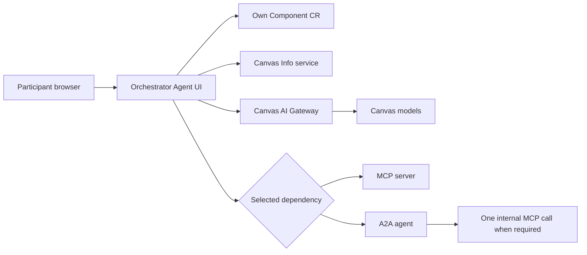

# AI-Native ODA Canvas Workshop

## Participant Guide

**Event:** Accelerate Asia  
**Format:** Guided collaborative workshop  
**Environment:** Shared AI-Native ODA Canvas hosted on AWS  
**Working unit:** Teams of 5–7 participants  
**Team deliverable:** One reviewed `component.yaml` and a short working demonstration

## 1. What you will do

Your team will design an AI-Native ODA Component that uses the pre-built Canvas Orchestrator Agent. You will declare one or more MCP or A2A dependencies for an assigned telecom use case, submit the Component definition to the facilitator, and validate the deployed agent through its chat interface.

You will not build an agent or deployment pipeline from scratch. The facilitator manages the shared runtime, deploys your Component, and gives your team its UI URL.

By the end of the workshop, your team should be able to explain:

- how an ODA Component declares exposed and dependent APIs;
- how MCP tools and A2A Agent Cards are discovered at runtime;
- how the orchestrator derives its domain capability catalogue from those dependencies;
- how the Canvas AI Gateway supplies the available models;
- how capability grounding, dependency selection, previews, and mutation confirmation work;
- what the current MVP deliberately does not support.

## 2. What is provided

The facilitator provides:

- a shared AI-Native ODA Canvas environment;
- a pre-built Orchestrator Agent runtime and chat UI;
- a Component template containing the preconfigured exposed UI, workload, service, RBAC, health probes, credentials integration, and observability configuration;
- pre-deployed MCP and A2A dependency components;
- synthetic workshop seed data;
- a dependency catalogue containing the exact exposed-API names;
- access to the participant repository;
- deployment of your submitted Component and the resulting UI URL.

Your team owns:

- the use-case interpretation;
- the Component metadata and `dependentAPIs` design within the supplied template;
- selection of the correct API names and protocol types;
- supported, unsupported, and safety test queries;
- the final demonstration and architectural observations.

## 3. Architecture at a glance



The Orchestrator Agent reads its own Component custom resource, resolves the declared dependencies through Canvas Info, discovers MCP tools or A2A skills, and builds a bounded capability catalogue. The selected Canvas model helps route and format a request, but the final answer must be grounded in one available dependency capability or a local discovery/status function.

## 4. Workshop agenda

| Day | Session | Duration | Outcome |
|---|---:|---:|---|
| Day 2 | 1 | 90 minutes | Understand Project Foundation, AI-Native ODA Canvas architecture, and operator patterns. |
| Day 2 | 2 | 90 minutes | Observe the reference implementation: Canvas model discovery, MCP, A2A, dependency discovery, guardrails, and observability. |
| Day 2 | 3 | 90 minutes | Form teams, select or receive a use case, inspect the dependency catalogue, and begin the Component design. |
| Day 3 | 4 | 90 minutes | Complete `component.yaml`, define test queries, and perform a team design review. |
| Day 3 | 5 | 90 minutes | Submit the Component, receive the deployed URL, and validate readiness, discovery, routing, and guardrails. |
| Day 3 | 6 | 90 minutes | Demonstrate the working agent and share architectural findings and potential standards improvements. |

## 5. Use cases and dependency catalogue

Begin with the scaffolded ODA Component in the Canvas Dashboard, then inspect the APIs exposed by that Component. Component IDs such as `TMFC001` and `TMFC005` identify the architectural dependency owners; TM Forum Open API identifiers such as `TMF620` and `TMF637` identify API contracts. After locating the Component, use the exposed MCP or A2A API **Name** exactly as shown. Dependency-name matching is exact and case-sensitive in the workshop design.

| ID | Team use case | Declare these dependencies | Protocol |
|---|---|---|---|
| UC-01 | Broadband Offer Explorer | `productcatalogmcp`, `productcataloga2a` | MCP and A2A |
| UC-02 | Installed Product Assistant | `productinventorymcp` | MCP |
| UC-03 | Service Inventory Assistant | `serviceinventorymcp` | MCP |
| UC-04 | Network Resource Locator | `resourceinventorymcp` | MCP |
| UC-05 | Service Qualification Advisor | `servicequalificationmcp`, `servicequalificationa2a` | MCP and A2A |
| UC-06 | Product Order Status Assistant | `productordera2a` | A2A |

For UC-06, `productordera2a` owns its internal dependency on `productorderingmcp`. The participant Component must not declare `productorderingmcp` directly.

## 6. Design your Component

### 6.1 Start from the supplied template

Do not create a new Helm chart or deployment pipeline. Copy the team template and edit only the areas marked for workshop use.

Review the following metadata with your team:

- a unique Component name and ID supplied or approved by the facilitator;
- a concise description of the assigned use case;
- version, functional block, owner, and maintainer values;
- the exact dependent API names and protocol types.

Do not change the preconfigured Orchestrator Agent implementation, UI path, port, temporary exposed `apiType`, health probes, service account, AI Gateway configuration, credentials configuration, or observability configuration.

### 6.2 Declare dependencies

Use this shape under `spec.coreFunction`:

```yaml
dependentAPIs:
  - name: productinventorymcp
    specification:
      - apiType: mcp
```

For a use case with MCP and A2A dependencies:

```yaml
dependentAPIs:
  - name: productcatalogmcp
    specification:
      - apiType: mcp
  - name: productcataloga2a
    specification:
      - apiType: a2a
```

Apply these rules:

1. Copy the dependency name from the workshop catalogue; do not invent an alias.
2. Use only `mcp` or `a2a` as the dependency `apiType`.
3. Use one dependency entry for each API.
4. Do not add URLs. Canvas resolves the deployed endpoints.
5. Do not add direct OpenAPI dependencies for this MVP.
6. Keep the rest of the supplied Component structure intact.

### 6.3 Team review before submission

Confirm all of the following:

- [ ] The Component name and ID are unique for the team.
- [ ] The description states the use-case boundary.
- [ ] Every dependency name exactly matches the catalogue.
- [ ] Each dependency has the correct MCP or A2A type.
- [ ] No endpoint URL, credential, token, or certificate is embedded.
- [ ] The supplied exposed UI and management configuration is unchanged.
- [ ] The YAML indentation and structure are valid.
- [ ] The team has prepared discovery, supported-domain, and unsupported-domain queries.

Submit the reviewed `component.yaml` through the channel specified by the facilitator.

## 7. Open and check the deployed agent

The facilitator will deploy your Component and return a team-specific URL. When the UI opens, check the sidebar before sending a domain query.

The following indicators should be green:

- **Component complete** — the Canvas reports the Component deployment as complete.
- **Component CR readable** — the agent can read its own Component resource.
- **AI Gateway reachable** — model discovery through the central gateway succeeded.
- **Dependencies resolved** — every declared dependency has a Canvas-resolved endpoint.
- **Capabilities available** — MCP tools or A2A skills were discovered.

If the AI Gateway is unavailable, the model selector displays **Not available** and is disabled. Local capability inspection can still work, but domain invocation cannot produce the expected model-grounded response.

Use **Refresh Dependent Services** in the sidebar after a facilitator corrects or redeploys a dependency. Refreshing discovery also cancels any pending mutation confirmation.

## 8. Use the chat interface

### 8.1 Select a model

The model dropdown is displayed above the chat input. The application default is selected when available. Choose another listed model only when your test plan requires comparison.

### 8.2 Select a dependency

The sidebar offers:

- **Auto** — the orchestrator selects one appropriate capability from the available dependencies;
- an explicit dependency name — routing is restricted to that dependency.

Use explicit selection when you want to compare MCP and A2A behavior for the same use case. Changing the selection cancels a pending mutation confirmation.

### 8.3 Inspect before invoking

These requests are answered locally from discovery metadata and do not call a domain dependency:

- `What capabilities are provided by this component?`
- `What MCP tools are available?`
- `What A2A skills are available?`
- `Show the Agent Card.`
- `What parameters are required by <capability-name>?`

The capability catalogue below the chat shows discovered dependencies, availability, tools or skills, descriptions, and bounded schema information.

### 8.4 Preview and confirm mutations

Asking to inspect parameters or preview arguments does not execute a capability. Create, update, delete, cancel, activate, or other state-changing requests require an explicit confirmation when classified as mutating.

The UI shows the selected capability and validated arguments, followed by **Confirm** and **Cancel** controls. Confirm only when:

- the operation is part of the assigned exercise;
- all data is synthetic;
- the dependency and capability are correct;
- the generated arguments match your intention.

A pending action is single-use and normally expires after five minutes. It is cancelled by a new query, dependency refresh, model change, or dependency-selection change.

## 9. Team test playbook

Run the tests in this order and record the result.

### Test 1 — Capability discovery

Ask:

> What capabilities are provided by this component?

Expected result: the response groups the available MCP tools and A2A skills by dependency.

### Test 2 — Protocol discovery

For MCP, ask:

> What MCP tools are available?

For A2A, ask:

> What A2A skills are available?

Expected result: the response is produced locally from the discovered protocol metadata.

### Test 3 — Supported list query

Run one of the supported queries from your use-case brief. Expected result: one dependency and one capability are selected, invoked, and identified in the response status line.

### Test 4 — Stable-identifier query

Query one of the documented workshop identifiers, such as `WS-PROD-1001`, `WS-SVC-1001`, `WS-RES-1001`, `WS-QUAL-1001`, or `PO-1001`.

Expected result: the answer is grounded in the seeded dependency response.

### Test 5 — Explicit dependency selection

If your use case has both MCP and A2A, select each dependency in turn and run an appropriate query.

Expected result: the status line names the selected dependency, API type, and capability.

### Test 6 — Guardrail

Ask:

> Who is the prime minister of India?

Expected result: the agent rejects the request as outside the Component's available domain capabilities.

### Test 7 — Safety behavior

If your assigned scenario includes an approved mutation, request a preview and then an intentional invocation using synthetic data.

Expected result: preview does not invoke the dependency; invocation requires confirmation; cancel performs no operation; confirm invokes exactly once.

## 10. Use-case briefs

### UC-01 — Broadband Offer Explorer

**Goal:** Discover seeded Product Catalog offerings and prices, identify the broadband products from the returned catalogue data, and compare direct MCP access with delegation to a Product Catalog A2A agent.

**Scaffolded dependency Component:** `TMFC001 — Product Catalog Management`

**Dependencies:** `productcatalogmcp`, `productcataloga2a`

Suggested queries:

- Invoke `product_offering_get` to list the name, ID, lifecycle status and category of every product offering in the catalog.
- Invoke `product_offering_get` with the returned Fiber Broadband 50 Mbps offering ID and describe the offering.
- Invoke `product_offering_price_get` to list every product offering price, including its name, amount, currency, recurring charge period and lifecycle status.

Unsupported control query:

- What service instances are active for customer CUST-1001?

Use explicit dependency selection to compare a direct MCP tool with the Product Catalog A2A skill. Each outer-agent query still invokes only one selected dependency. Do not rely on a follow-up such as `Describe it`; paste the generated offering ID into the complete request.

See the [UC-01 Broadband Offer Explorer participant guide](UC-01-Broadband-Offer-Explorer.md) for the complete exercise and expected results.

### UC-02 — Installed Product Assistant

**Goal:** Find installed products and explain their lifecycle state.

**Scaffolded dependency Component:** `TMFC005 — Product Inventory Management`

**Dependency:** `productinventorymcp`

Suggested queries:

- What products are installed for customer CUST-1001?
- Which installed products are currently active?
- Describe installed product WS-PROD-1001.

Unsupported control query:

- What network resources are available at the Mumbai site?

Use the stable workshop identifier as a product serial number rather than as an API-generated Product resource ID.

See the [UC-02 Installed Product Assistant participant guide](UC-02-Installed-Product-Assistant.md) for the complete exercise and expected results.

### UC-03 — Service Inventory Assistant

**Goal:** Find service instances and explain active, inactive, or terminated states.

**Dependency:** `serviceinventorymcp`

Suggested queries:

- What service instances are available?
- Which service instances are not active?
- Describe service WS-SVC-1001.

Unsupported control query:

- What product offering prices are available?

See the [UC-03 Service Inventory Assistant participant guide](UC-03-Service-Inventory-Assistant.md) for the complete exercise and expected results.

### UC-04 — Network Resource Locator

**Goal:** Locate seeded network resources by type, state, and workshop location.

**Dependency:** `resourceinventorymcp`

Suggested queries:

- List every router resource at the Accelerate Asia workshop locations across all resource statuses.
- Which resources have a resource status other than available?
- Describe resource WS-RES-1001.

Unsupported control query:

- What is the status of product order PO-1001?

See the [UC-04 Network Resource Locator participant guide](UC-04-Network-Resource-Locator.md) for the complete exercise and expected results.

### UC-05 — Service Qualification Advisor

**Goal:** Retrieve and explain seeded qualification outcomes. These are reference outcomes, not live network eligibility decisions.

**Scaffolded dependency Component:** `TMFC009 — Service Qualification Management`

**Dependencies:** `servicequalificationmcp`, `servicequalificationa2a`

Suggested queries:

- Invoke `query_service_qualification_get` to list every qualification record.
- Invoke `query_service_qualification_get` with `external_id WS-QUAL-1001` and explain the result.
- Invoke `service-qualification-query` to explain qualification result `WS-QUAL-1002`.
- Preview the parameters required to create a service qualification request.

Facilitator-controlled mutation:

- Create a service qualification request for the workshop test location using the provided arguments.

Unsupported control query:

- Activate the qualified service on the network.

Use explicit dependency selection to compare direct MCP access with delegation to the Service Qualification A2A skill. Treat the seeded records as persisted reference outcomes rather than live network decisions.

See the [UC-05 Service Qualification Advisor participant guide](UC-05-Service-Qualification-Advisor.md) for the complete exercise and expected results.

### UC-06 — Product Order Status Assistant

**Goal:** Retrieve and explain seeded product-order status through an A2A agent.

**Dependency:** `productordera2a`

Suggested queries:

- What is the status of product order PO-1001?
- Which product orders are currently in progress?
- Explain why product order PO-1003 is held.

Unsupported control query:

- Cancel product order PO-1001.

The workshop skill is status-focused. The A2A agent may make one internal call to its Product Ordering MCP dependency, but the participant Component does not declare or invoke that MCP dependency directly.

## 11. Acceptance checklist

Your team demonstration is ready when:

- [ ] The Component reports `Complete` in the Canvas.
- [ ] All five UI readiness indicators are green.
- [ ] The selected model is available through the AI Gateway.
- [ ] Every declared MCP tool list or A2A Agent Card is discovered.
- [ ] The general capability query succeeds.
- [ ] One supported list query succeeds.
- [ ] One stable-identifier query succeeds.
- [ ] An unsupported-domain query is rejected.
- [ ] Any approved mutating request requires preview and explicit confirmation.
- [ ] The response identifies the dependency, API type, capability, model, and execution status.
- [ ] The final answer is grounded in the selected dependency response.
- [ ] The team can explain the Component design and current MVP constraints.

## 12. MVP boundaries and workshop safety

The current implementation has deliberate limits:

- It supports MCP and A2A dependencies; generic OpenAPI invocation is excluded.
- It invokes at most one outer dependency capability per user query.
- It does not chain multiple tools or skills in the outer orchestrator.
- An A2A agent may make one internal MCP invocation as part of its own skill.
- Chat messages are retained for display, but previous turns are not supplied as model context. Treat each query as self-contained.
- The UI is declared as `apiType: openapi` only as a temporary Canvas routing workaround; it is not an OpenAPI service.
- No Canvas API-gateway authentication policy protects the workshop UI.
- All successfully discovered dependency capabilities are available; discovery is not authorization.
- Tool descriptions and model guardrails reduce unsupported routing but cannot guarantee perfect classification.
- Capability results may be large. Ask a narrower query or request selected fields when a broad list is difficult to read.

Workshop safety rules:

1. Use only the facilitator-provided URL and do not share it outside the workshop.
2. Use only synthetic workshop data; never enter production, personal, confidential, or credential data.
3. Do not paste tokens, client secrets, certificates, or internal endpoint URLs into chat.
4. Review every mutation preview and cancel unexpected operations.
5. Do not use the workshop environment for production decisions or live network actions.

## 13. Troubleshooting

| Symptom | What to check | Next action |
|---|---|---|
| Component is not complete | Deployment or Canvas reconciliation has not completed. | Give the Component name to the facilitator. Do not edit runtime settings yourself. |
| Component CR is not readable | Component name, RBAC, or runtime configuration is incorrect. | Ask the facilitator to verify the deployed release and service account. |
| AI Gateway shows unavailable | Model discovery or the credential Secret is unavailable. | Ask the facilitator to verify AI Gateway reachability and credentials. |
| Dependency is unresolved | The declared name does not exactly match a deployed exposed API, or Canvas has not published its URL. | Compare the YAML with the dependency catalogue; ask the facilitator to verify Component completion. |
| MCP capability discovery fails | The MCP endpoint or protocol initialization/tool listing failed. | Refresh once; then provide the dependency name and visible error to the facilitator. |
| A2A capability discovery fails | The Agent Card could not be retrieved. | Refresh once; then provide the dependency name and visible error to the facilitator. |
| Request is reported as unsupported | No discovered capability matches the request strongly enough. | Rephrase using the domain resource and stable workshop identifier; optionally select the dependency explicitly. |
| Wrong dependency is selected | Auto routing chose another available dependency. | Select the intended dependency in the sidebar and retry the self-contained query. |
| Mutation confirmation disappeared | It expired or was cancelled by a new query, refresh, model change, or dependency change. | Submit the intended request again, review the new preview, and confirm once. |
| Answer is too long or incomplete | The dependency returned a broad result. | Ask for a smaller subset, a stable identifier, a status filter, or selected fields. |

## 14. Team demonstration

Keep the final demonstration short and evidence-based:

1. State the use case and domain boundary.
2. Show the relevant `dependentAPIs` design.
3. Show all readiness indicators in the deployed UI.
4. Show discovered tools or skills.
5. Run one supported query and one stable-identifier query.
6. Run the unsupported-domain control query.
7. If applicable, show preview and confirmation without using non-synthetic data.
8. Share one architectural observation or standards improvement.

## 15. Glossary

**A2A:** Agent-to-Agent protocol used to publish an Agent Card and invoke a declared agent skill.

**Agent Card:** Metadata describing an A2A agent, its endpoint profile, and available skills.

**AI Gateway:** The Canvas-wide LiteLLM proxy used to discover and invoke the models made available to all workshop Components.

**Capability catalogue:** The bounded runtime view of discovered MCP tools and A2A skills used for display, routing, and grounding.

**Canvas Info:** The Canvas service used to resolve a Component's declared dependency names to deployed API endpoints.

**Component CR:** The Kubernetes custom resource describing an ODA Component, including its exposed and dependent APIs.

**Dependent API:** An API that the Component consumes. Workshop dependencies use MCP or A2A.

**Exposed API:** An interface published by a Component. The workshop UI uses `apiType: openapi` temporarily because the current Canvas has no UI-specific interface type.

**MCP:** Model Context Protocol, used here for tool discovery and invocation through Streamable HTTP and JSON-RPC.

**Orchestrator Agent:** The pre-built Streamlit application that discovers Component capabilities, selects one dependency capability, invokes it, and returns a grounded response.
